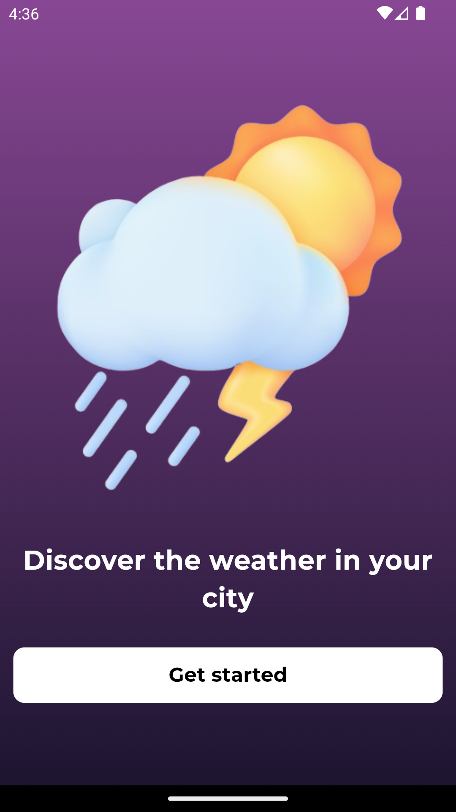
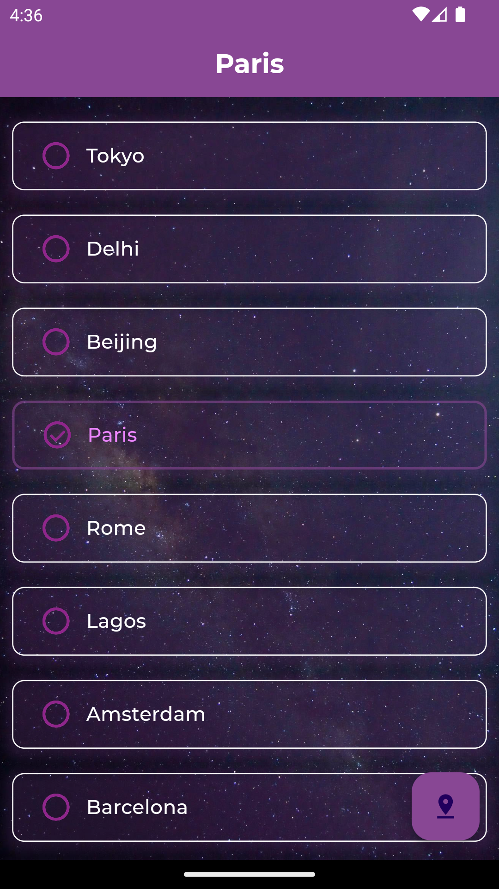
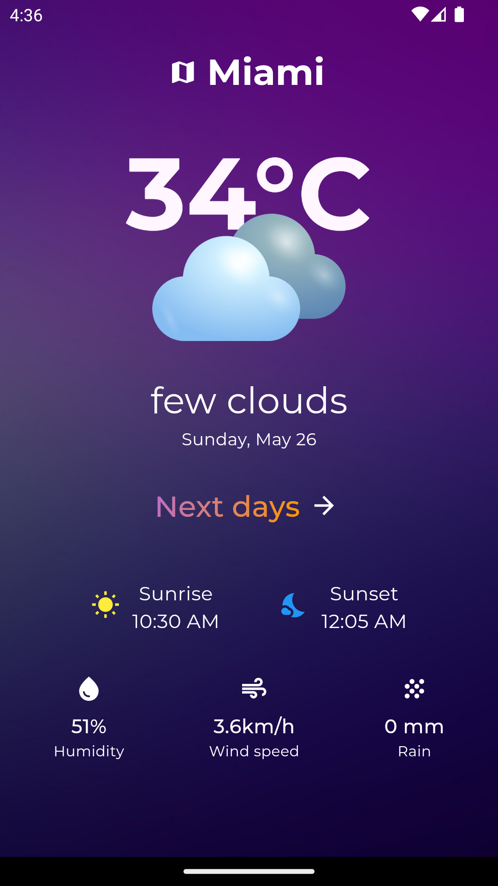
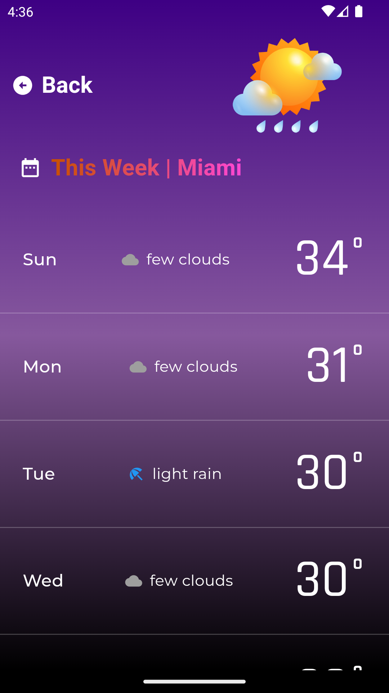

# Weather App

A simple weather application built with Flutter that provides current weather information and a weekly forecast for selected cities.

## Features
- View current weather information for a selected city
- See a weekly forecast with detailed weather data
- Navigate between screens with a smooth and intuitive interface
- Customizable theme with gradient backgrounds and custom fonts
- Interactive splash screen 

## Dependencies
- intl
- http
  
## Screenshots

